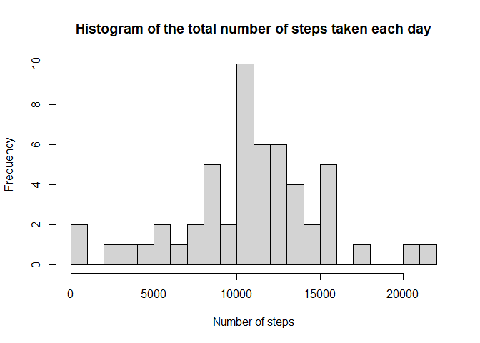
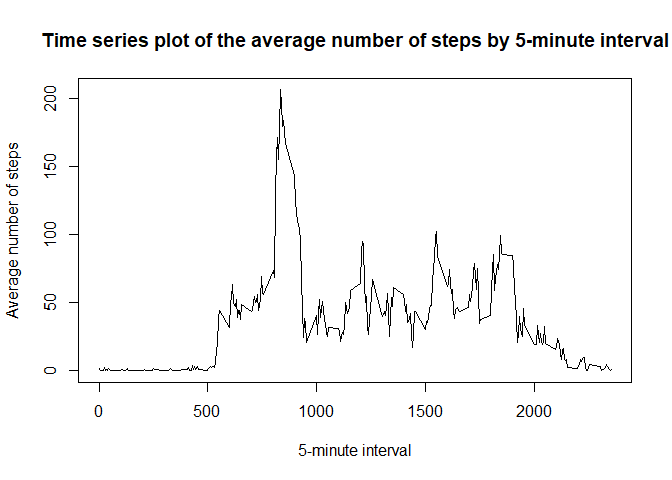
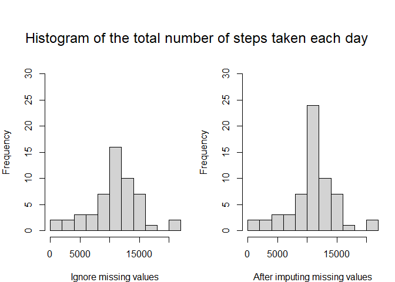
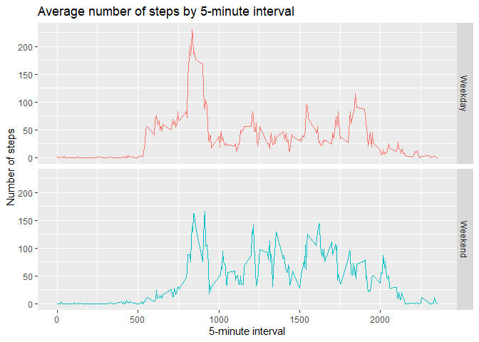

## Loading and preprocessing the data

The first step is to download and read the data into R, and the function *str()* will give me some basic information about the variables in this dataset.


```r
download.file("https://d396qusza40orc.cloudfront.net/repdata%2Fdata%2Factivity.zip", "activity.zip")
unzip("activity.zip")
data<-read.csv("activity.csv")
str(data)
```

```
## 'data.frame':	17568 obs. of  3 variables:
##  $ steps   : int  NA NA NA NA NA NA NA NA NA NA ...
##  $ date    : chr  "2012-10-01" "2012-10-01" "2012-10-01" "2012-10-01" ...
##  $ interval: int  0 5 10 15 20 25 30 35 40 45 ...
```

The "date" variable in the data set has type "character", which needs to be changed to "Date" format. In this analysis, I make use of the *dplyr* package to manipulate the data.


```r
library(dplyr)
```

```
## 
## Attaching package: 'dplyr'
```

```
## The following objects are masked from 'package:stats':
## 
##     filter, lag
```

```
## The following objects are masked from 'package:base':
## 
##     intersect, setdiff, setequal, union
```

```r
data<-mutate(data, date=as.Date(data$date, "%Y-%m-%d"))
class(data$date)
```

```
## [1] "Date"
```

There are some missing values in the variable "steps", which will be taken care of in the later part of this analysis. For now, I will just create a new data set, with missing values removed.


```r
data_nonmissing<-filter(data, !is.na(steps))
head(data_nonmissing)
```

```
##   steps       date interval
## 1     0 2012-10-02        0
## 2     0 2012-10-02        5
## 3     0 2012-10-02       10
## 4     0 2012-10-02       15
## 5     0 2012-10-02       20
## 6     0 2012-10-02       25
```

```r
summary(data_nonmissing$steps)
```

```
##    Min. 1st Qu.  Median    Mean 3rd Qu.    Max. 
##    0.00    0.00    0.00   37.38   12.00  806.00
```
From the summary of the variable "steps" above we can see that there are no missing values any more.  


## What is mean total number of steps taken per day?
In order to obtain the total number of steps taken per day, we need to sum up the steps across all intervals for each day,  i.e. calculate the sum of "steps" by "date".


```r
steps_byD<-data_nonmissing %>% 
    group_by(date) %>%
    summarise(total.steps=sum(steps))
```

```
## `summarise()` ungrouping output (override with `.groups` argument)
```
    
The R code below produces the histogram of the total number of steps taken each day:

```r
hist(steps_byD$total.steps, breaks=20, xlab="Number of steps", 
     main="Histogram of the total number of steps taken each day")
```

<!-- -->

The mean and median of the total number of steps taken per day can be obtained using *summary()* function. The two values are very close, and they are 10,766 and 10,765 respectively.


```r
summary(steps_byD$total.steps)
```

```
##    Min. 1st Qu.  Median    Mean 3rd Qu.    Max. 
##      41    8841   10765   10766   13294   21194
```

## What is the average daily activity pattern?

In order to calculate the the average number of steps (averaged across all days) taken within each interval, I group the data set by "interval" this time.  


```r
steps_byIntv<-data_nonmissing %>% 
    group_by(interval) %>%
    summarize(avg.steps=mean(steps))
```

```
## `summarise()` ungrouping output (override with `.groups` argument)
```

```r
with(steps_byIntv, plot(interval, avg.steps , type="l", 
     xlab="5-minute interval", ylab="Average number of steps"))
title(main="Time series plot of the average number of steps by 5-minute interval")
```

<!-- -->

The chart above shows a time series plot with the 5-minute interval on the x-axis and the average number of steps taken on the y-axis.  

The 5-minute interval "835", on average across all the days in the data set, contains the maximum number of steps.


```r
filter(steps_byIntv,avg.steps==max(avg.steps))
```

```
## # A tibble: 1 x 2
##   interval avg.steps
##      <int>     <dbl>
## 1      835      206.
```


## Imputing missing values

Now go back to our original data set, out of the 17,568 observations there are 2304 rows containing missing values for variable "steps", and that is about 13%.


```r
dim(data)
```

```
## [1] 17568     3
```

```r
summary(data$steps)  
```

```
##    Min. 1st Qu.  Median    Mean 3rd Qu.    Max.    NA's 
##    0.00    0.00    0.00   37.38   12.00  806.00    2304
```

```r
mean(is.na(data$steps)) 
```

```
## [1] 0.1311475
```

### Imputation strategy
To impute the missing value in the data, I use the average number of steps (averaged across all days) for that interval, which has already been calculated in the previous section.

I use a *for* loop to do the imputation. For each row of the data set, check whether the value for "steps" is missing or not. If missing, assign the average number of steps to it according to its "interval".


```r
n<-dim(data)[1]

for (i in 1:n) {
    if (is.na(data$steps[i])) {
        intv<-data$interval[i]
        data$steps[i]<-as.numeric(steps_byIntv[steps_byIntv$interval==intv,2])
    }
}
```

We can take a look at the first few rows of the data, and the `sum(is.na(data$steps))` gives 0 means there are no more missing values in the data.


```r
head(data)
```

```
##       steps       date interval
## 1 1.7169811 2012-10-01        0
## 2 0.3396226 2012-10-01        5
## 3 0.1320755 2012-10-01       10
## 4 0.1509434 2012-10-01       15
## 5 0.0754717 2012-10-01       20
## 6 2.0943396 2012-10-01       25
```

```r
sum(is.na(data$steps))
```

```
## [1] 0
```

I plot the histogram of the total number of steps taken each day from this new data set (the one on the right). Comparing to the one produced earlier with the missing values removed, it looks like the peak is still around 100,000 - 120,000. However, second histogram has more values concentrated around the median value.


```r
steps_byD2<-data %>% 
    group_by(date) %>%
    summarize(total.steps=sum(steps))
```

```
## `summarise()` ungrouping output (override with `.groups` argument)
```

```r
par(mfrow=c(1,2), mar=c(4,4,2,1), oma=c(0,0,4,0))
hist(steps_byD$total.steps, breaks=15, ylim=c(0,30), xlab="Ignore missing values", main="")
hist(steps_byD2$total.steps, breaks=15, ylim=c(0,30), xlab="After imputing missing values", main="")

mtext("Histogram of the total number of steps taken each day", outer=T, cex=1.5)
```

<!-- -->

The R code below shows the mean and median of the total steps taken per day from the two data sets. The mean values are exactly the same, which is expected because we have imputed the missing values use the mean steps across all days. The median values are also very close.  
However, we can see that the first quartile is higher in the imputed data, while its third quartile is lower. This is consistent with the observation from the above histograms, i.e. the imputation makes the estimates of the total daily number of steps more clustered in the middle area of the values.


```r
remove_missing<-summary(steps_byD$total.steps)
impute_missing<-summary(steps_byD2$total.steps)
print(rbind(remove_missing,impute_missing))
```

```
##                Min. 1st Qu.   Median     Mean 3rd Qu.  Max.
## remove_missing   41    8841 10765.00 10766.19   13294 21194
## impute_missing   41    9819 10766.19 10766.19   12811 21194
```


## Are there differences in activity patterns between weekdays and weekends?

I create a variable called "wkday" to indicate if that day is a weekday or a weekend, and then calculate the average number of steps taken, averaged across all weekday days or weekend days. The results have been stored in the data frame called "data_bywkd". 


```r
weekday <- c('Monday', 'Tuesday', 'Wednesday', 'Thursday', 'Friday')

data_bywkd<-data %>% 
    mutate(wkday=ifelse(weekdays(date) %in% weekday,1,2)) %>%
    mutate(wkday=factor(wkday,labels=c("Weekday","Weekend"))) %>%
    group_by_at(.vars=vars(one_of(c("interval","wkday")))) %>%
    summarize(avg.steps=mean(steps))
```

```
## `summarise()` regrouping output by 'interval' (override with `.groups` argument)
```

```r
head(data_bywkd)
```

```
## # A tibble: 6 x 3
## # Groups:   interval [3]
##   interval wkday   avg.steps
##      <int> <fct>       <dbl>
## 1        0 Weekday    2.25  
## 2        0 Weekend    0.215 
## 3        5 Weekday    0.445 
## 4        5 Weekend    0.0425
## 5       10 Weekday    0.173 
## 6       10 Weekend    0.0165
```

I use *ggplot2* package to make the time series plots of the 5-minute interval and the average number of steps taken, averaged across all weekday days or weekend days.


```r
library(ggplot2)
g<-ggplot(data_bywkd, aes(interval, avg.steps))

g+geom_line(aes(color=wkday),show.legend = FALSE)+facet_grid(wkday~.)+
    labs(x="5-minute interval",y="Number of steps", 
         title="Average number of steps by 5-minute interval")
```

<!-- -->

Comparing the two plots, we can see that there is outstanding peak on Weekdays around interval 830, which is not observed on weekends. On the contrary, we see that the number of steps between interval 1000 to 2000 are generally lower on weekdays, except for interval 1830 (which is usually the time people get off work).


